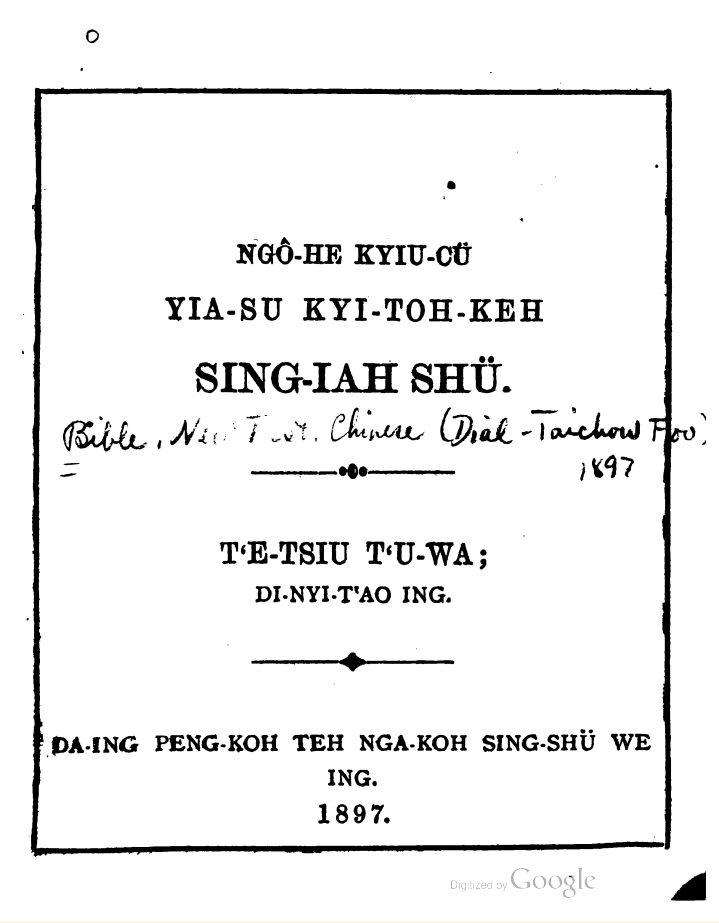

**_（注意本文檔旨在漢語方言研究，保存中華文化，請勿誤解和曲解，請勿非法傳教。）_**

這本《我許救主耶穌基督個新約書》，是由19世紀末在台州的西洋傳教士路惠理（William David Rudland）編寫的，使用的是台州土話拼音羅馬字，這可能也是台州話最早的羅馬拼音了，大致反映了當時台州府方言的讀書音。這套拼音應該是參考了寧波話《新約》所使用的寧波話拼音，所以可能會有一些寧波話的影響。

目前在網上能找到1897年第二版的pdf文檔。現將其手工錄入爲文本格式，方便做方言研究。由於是手工的原因，難免會出現錯誤，有問題請參考原文檔。

目前進度：

- [x] 轉錄爲文本
- [ ] 初次審核【統一格式，糾正轉錄錯誤】
- [ ] ……
- [ ] ……
- [ ] ……

後期可能會考慮將其轉譯為漢字，但這是一項艱難的任務，當時的方言用詞跟今天不同，而且與周邊方言溝通更頻繁，可能需要結合寧波話讀本才能正確轉譯。很多方言用詞又沒有規範的正字，所以轉譯出來的也必定具有主觀性。

**_（注意本文檔旨在漢語方言研究，保存中華文化，請勿誤解和曲解，請勿非法傳教。）_**
